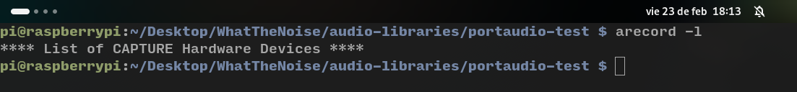
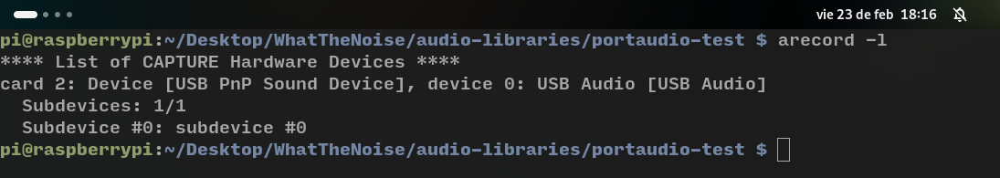

# PortAudio 
En el fichero `record.c` se lleva a cabo una captura de audio y su posterior reproducción. Se trata de un programa de [ejemplo](https://portaudio.com/docs/v19-doxydocs/paex__record_8c_source.html). Se activa la escritura a fichero cambiando el flag de `WRITE_TO_FILE` de `0` a `1`. Se procede a probar la captura de audio. Es necesairo conectar un micrófono USB a la RaspBerry, ya que no tiene dispositivos de audio. Esto se comprueba con el comando `arecord -l`:

Tras enchufar el micrófono se comprueba que el dispositivo de audio se ha reconocido:

