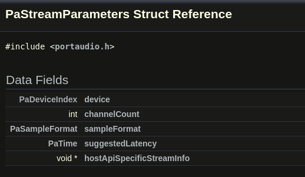
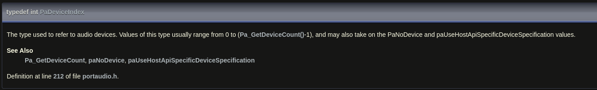

[Portaudio](https://files.portaudio.com/docs/v19-doxydocs-dev/api_overview.html)

# PaStreamParameters
Parámetros para la dirección de un stream de audio (entrada o salida)

## PaDeviceIndex
Tipo de dato par referirse a los dispositivos de audio
