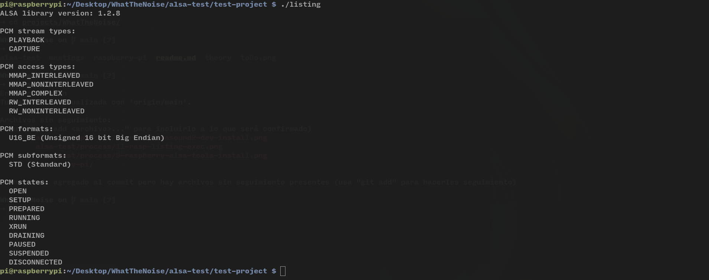

# Primeros pasos
- Se enchufa la raspberry a una fuente de alimentación de 5V - 3A 
- Se introduce la microSD proporcionada
- Se conecta el cable HDMI
- Se enciende la raspberry
- Todo funciona correctamente
- Se conecta la red Wi-Fi
- A través de ssh me conecto a la raspberry
- Trabajaré así todo el tiempo para mayor comodidad

# Actualización de software
Se ejecuta `sudo apt update && sudo apt upgrade` para  actualizar el software de la raspberry. A continuación se procederá a instalar `alsa-lib` para testear el primer programa de ejemplo (*listing*) y ver qué sucede.  
Se obtiene la salida de *listing*:
