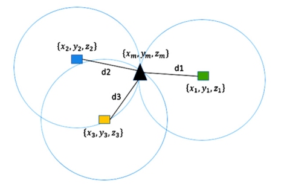
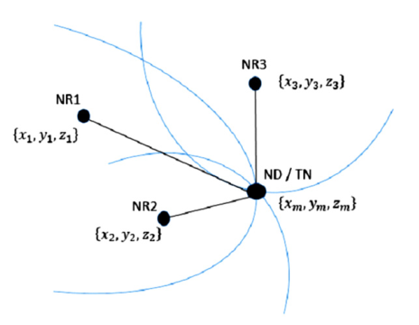

# Links
- [Ejemplo TDOA Matlab](https://es.mathworks.com/help/fusion/ug/object-tracking-using-time-difference-of-arrival.html)
- [Multilateración - Wikipedia](https://es.wikipedia.org/wiki/Multilateraci%C3%B3n)

# Interesant projects
- [Acoustic Locator (C)](https://github.com/jayathungek/acoustic-locator)
- [TODA Localization (Python)](https://github.com/vineeths96/TDOA-Localization)

# Algoritmos de radiolocalización
## ToA (Time of Arrival)
Técnica de posicionamiento que permite medir la distancia, estableciendo así la ubicación. 
En este escenario se plantean múltiples nodos referencia (NR) que en sincronía permiten hallar un nodo destino (ND). Asumiendo un escenario coplanar, donde las posiciones de los NR son conocidas, sólo tres NR y tres mediciones de distancias (ToA) bastarán para localizar el ND.  

## TDoA (Time Difference of Arrival)
La estimación en la Diferencia del Tiempo de Llegada requiere la medición de la diferencia de tiempo entre las señales entrantes hacia dos NR. Geométricamente puede representarse mediante hipérbolas.  
Asumiendo de nuevo un escenario coplanar donde hay tres NR (sus coordenadas son conocidas), con dos mediciones TDoA se podrá localizar el ND.   
